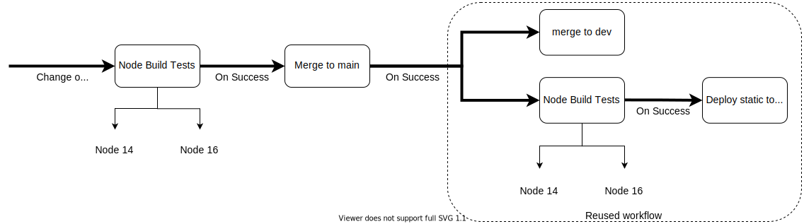
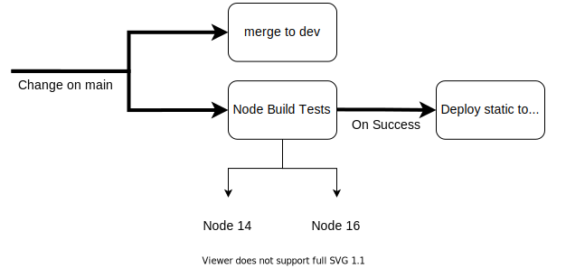

# fintech-devops

## Automated webpage deployment

[Live Site](https://williamng95.github.io/fintech-devops/)

upon checks passing in dev branch (triggered by pull request/push), the following should happen:
- source code is merged from `dev` to `main` 
- code on `main` is deployed to `gh-pages` as live site

This means that ideally, code should not be directly commited to `main`

Instead, `dev` serves as a staging area to build and test commits, before automatic deployment

### Code Checks
Default build checks for Node 12, 14, 16

### GitHub pages deployemnt
Leverages gh-pages, as suggested by React.js[^1]

For gh-pages to work within GitHub Actions, git config must be defined explicitly and fed to deploy script [^2][^3]

### Code Reuse
Deployment of `gh-pages` is set in a different workflow and reused in the CI action, after merge is completed on main[^4]

This is to allow for automatic deployment if the need arises to directly commit on `main`

## Process Flow:

## TODO:

- [X] trigger auto deploy from `main`
- [X] trigger auto merge from `dev`
- [X] check full flow
- [ ] complete README
- [ ] prettify page :tada:

<!--REFERENCES-->
[^1]:https://create-react-app.dev/docs/deployment/#github-pages

[^2]:https://github.com/tschaub/gh-pages

[^3]:https://github.com/tschaub/gh-pages/issues/345

[^4]:https://docs.github.com/en/actions/learn-github-actions/reusing-workflows#creating-a-reusable-workflow
