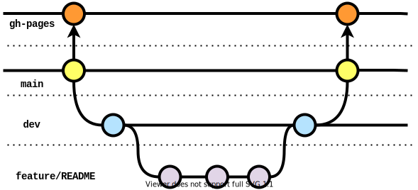

# fintech-devops

## Automated webpage deployment

[Live Site](https://williamng95.github.io/fintech-devops/)

### Overview
Upon checks passing in dev branch (triggered by pull request/push), the following should happen:
- source code is merged from `dev` to `main` (CI)
- code on `main` is deployed to `gh-pages` as live site (CD)

### Motivation

For static web apps that are created with libraries such as React, the project files need to be 'built'/deployed into the actual html and javascript files that the end user will receive.

As this is a repetitive process, we can leverage the power of GitHub Actions to dramatically simplify the development workflow. This also ensures that the webpage is always up to date without the need for manual intervention.

### Branches
This repo contains a number of branches:
- `main` where the source for the curent webpage lives
- `gh-pages` where the webpage is actually deployed into
- `dev` where all completed work is supposed to be staged into
- `features/...` where development is active (eg webpage)

### Code Checks
Check build status for Node 14, 16

### GitHub pages deployment
Leverages gh-pages, as suggested by React[^1]

For gh-pages to work within GitHub Actions, git config must be defined explicitly and fed to deploy script [^2][^3]

### Action Reuse
Deployment of `gh-pages` is set in a different workflow and reused in the CI action, after merge is completed on main[^4]

This is to allow for automatic deployment if the need arises to directly commit on `main`

The deployment workflow also needs to be called explicitly in the full CI/CD workflow, as GitHub's default policy prevents GitHub Actions from triggering further events recursively[^5]

## Process Flow:
Completed code from `features/...` is merged on to the `dev` branch, triggering a series of actions. 

If the merged code on `dev` can build, `dev` is merged onto `main` and then deployed to `gh-pages`.

An action to deploy is also in place in case any code is directly commited to main, so that `gh-pages` and `main` are always in sync.

This action however means that `dev` will need to be manually merged back, due to unrelated history and potential for conflicts.

## Git branches

## Summary:

An automated workflow to deploy a React/Gatsby app to GitHub Pages is demonstrated. Gatsby was used for this static site as suggested by React.[^6]

Strict adherence on where to commit changes is critical, as deviations may break the flow of the process.

## TODO:

- [X] trigger auto deploy from `main`
- [X] trigger auto merge from `dev`
- [X] check full flow
- [X] complete README
- [ ] prettify page :tada:

<!--REFERENCES-->
[^1]:https://create-react-app.dev/docs/deployment/#github-pages

[^2]:https://github.com/tschaub/gh-pages

[^3]:https://github.com/tschaub/gh-pages/issues/345

[^4]:https://docs.github.com/en/actions/learn-github-actions/reusing-workflows#creating-a-reusable-workflow

[^5]:https://docs.github.com/en/actions/learn-github-actions/events-that-trigger-workflows#triggering-new-workflows-using-a-personal-access-token

[^6]:https://reactjs.org/docs/create-a-new-react-app.html#gatsby
